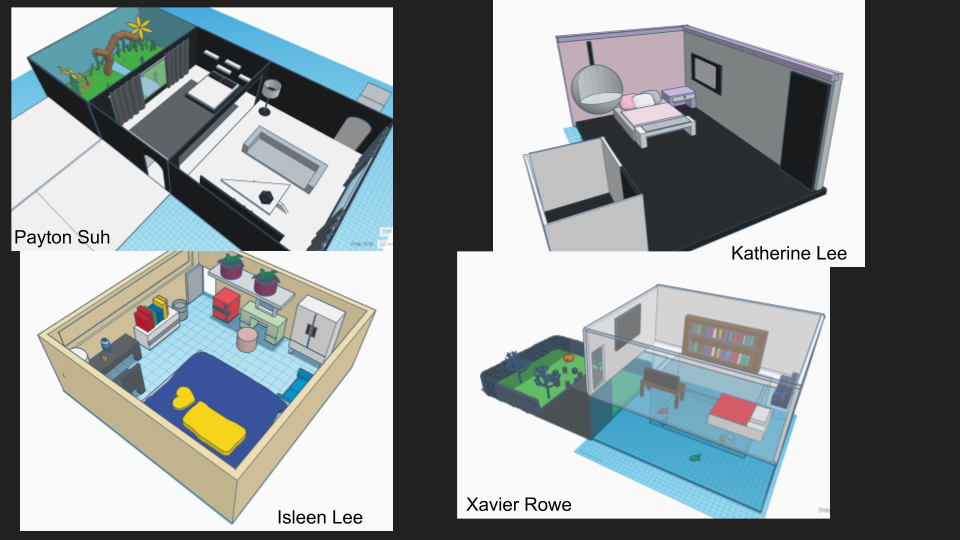

---
author:
    - Chris Bradfield
    - ✉ c.bradfield@lausd.net
title: Makerspace Gr. 7
date: September 17, 2020
---

------

> Only those who dare to fail greatly can ever achieve greatly.
> - Robert F. Kennedy

## About me

* SA: Engineering/Computer science
* Developer/Systems engineer
* Former SA parent

## Innovation Lab

* Hands-on
* Access
* Project-based
* Exploratory

-----

## Units

* CAD/3D modeling
* Electronics & circuit design
* Programming
* Machine learning & AI
* Simulation
* Data science

## Iterative design

Identify → Research → Brainstorm → Plan → Create → Test → Improve

##

## Get Help

* Lunch
* Office hours
* After school

## Questions?

